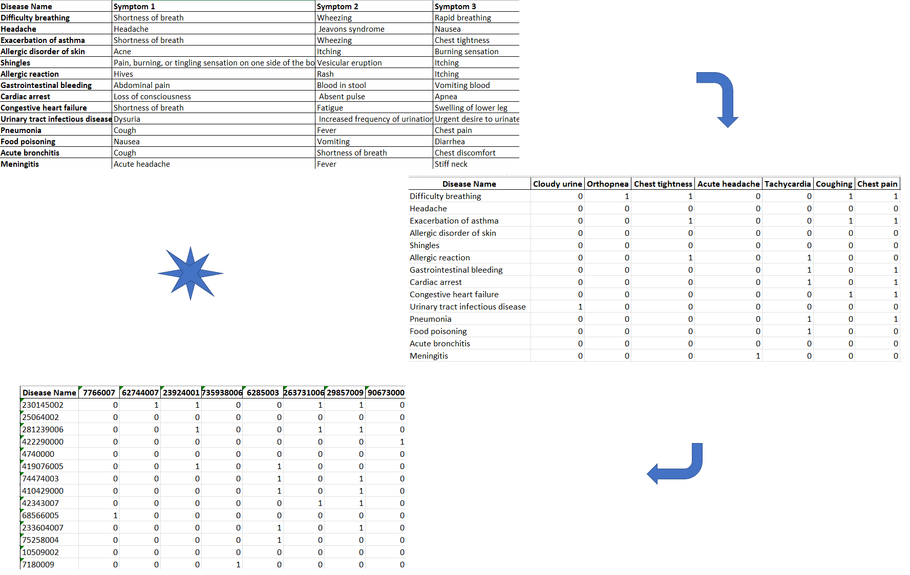
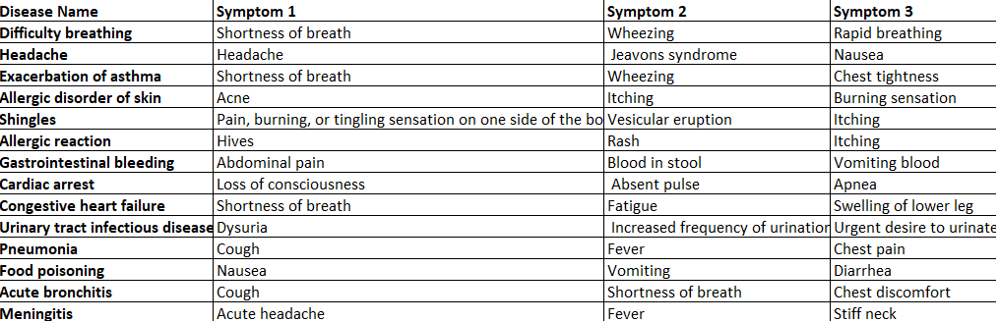
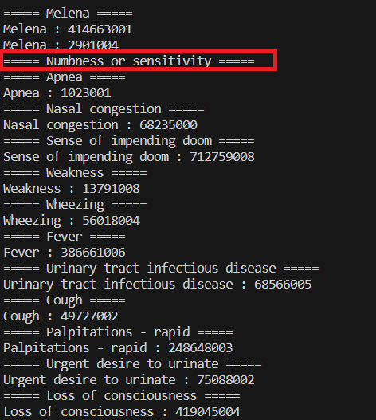
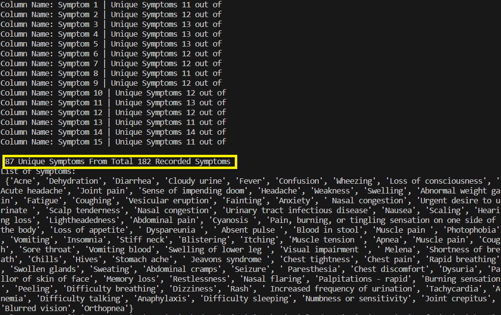
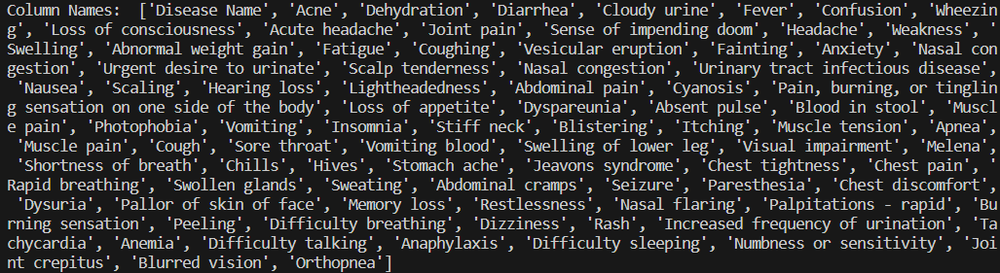
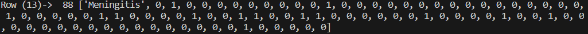

# Feature Engineer &amp; Medical Encode (Diseases and Symptoms)

Python tool to automate dataset creation from minimal list of diseases along with their corresponding diseases (Feature Engineer &amp; Medical Encode).

Input File Extension <em><strong>XLSX</strong></em>

### Output Files:
* Feature Engineered file.
* Medical encoded file.

### Steps:

1) Have your list of diseases and their corresponding symptoms in a table prepared as the following format; first column is the disease name and add corresponding symptoms upto column N (One symptoms per column cell, unlimited number of columns as per your need), <em><strong>as follows</strong></em>:

2) Update The file name and sheet name accordingly.

> file_name = 'File Name'
>
> name_sheet = 'Sheet1'

3) Run the script, sip coffee, and wait for the output :) 

### Caution: 

If an <strong>incorrect</strong> term was used for a disease name or a symptom that has no matching code in the medical dictionary it shall have the value of 0. Check the console output to ensure that you are using the correct term. Below highlighted in red, a case of using a symptom that has no matching term in the medical dictionary. 

<em><strong>Note:</em></strong> Incase of having non-matching terms, [SNOMED CT Official Website](https://browser.ihtsdotools.org/) can be referenced to acquire correct terms. 

If a used term have multiple matching codes, each matching code can be found in corresponding output segment (i.e. Melena in the above sample).

### Console Output:

This tool outputs multiple useful information such as:

* List of Symptoms:

* List of Column Names int eh feature engineered file:

* Values of each added row to the final dataset (row index, count of row values, row values):

* Each diseases name and symptoms along with their matching medical code (if any).

### References:
* [Pandas Library](https://pandas.pydata.org/).
* [Numpy Library](https://numpy.org/).
* [SNOMED Open Source](https://github.com/IHTSDO/SNOMED-in-5-minutes).
* [SNOMED CT Official Website](https://browser.ihtsdotools.org/).
